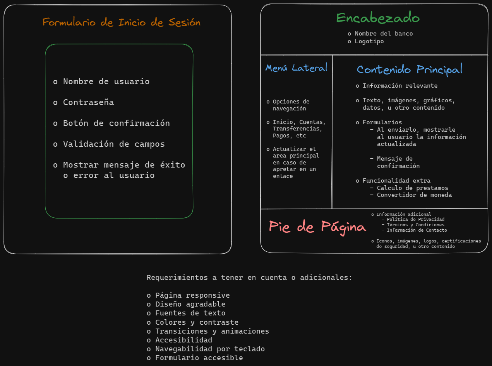
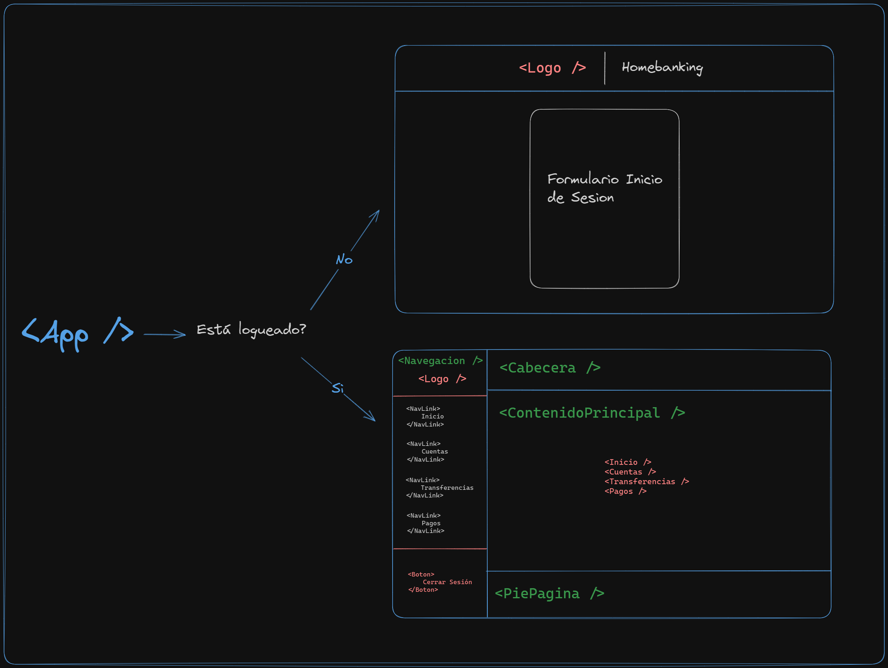

# Homebanking - ITBA Fullstack

## ⛳ Sprint 1 - Maqueta de Homebanking

#### 💻 Pantallas de Usuario:

- Formulario de Inicio de Sesión
  - Nombre de usuario
  - Contraseña
  - Boton
  - Validación
  - Mensaje al usuario
- Página principal
  - Encabezado
  - Menu Lateral
  - Sección Principal
  - Pie de Página

#### 🧷 Boceto de la Maqueta:

## ⛳ Sprint 2 - Migración a React

